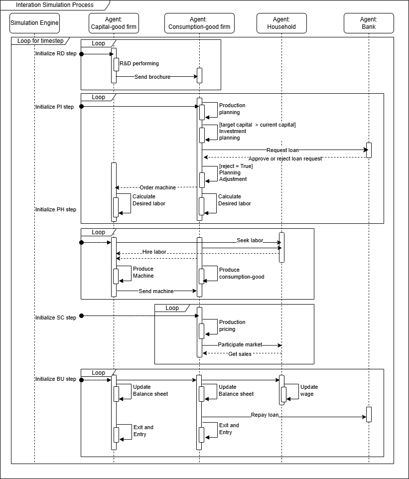
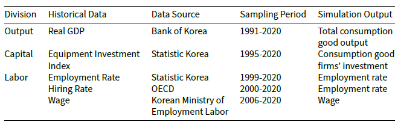

# Finance and Market Concentration Using Agent-Based Modeling : Evidence from South Korea

## Abstract

This study investigates the role of finance in shaping the global trend of increasing market concentration. Using agent-based modeling (ABM), we conduct qualitative and quantitative analyses to examine the impact of financial policies on market concentration. Additionally, we analyze their simultaneous effects on economic growth and labor income share as key macroeconomic indicators. Building upon the Keynes meets Schumpeter (K+S) model, we conduct policy experiments using a model validated against the historical trends in South Korea. For the policy variables, we apply the debt-to-sales ratio (DSR) limit and interest rate as levers to regulate the quantity and cost of finance, respectively. The simulation results show that lowering interest rates alleviates market concentration while DSR regulation exhibits nonlinear effects on it. As the DSR limit increases, market concentration initially decreases but rises again beyond a certain threshold. To investgiate the rationale behind this phenomenon, we examine how finance affects individual firms at a micro level through firm-level analysis. Our findings underscore the value of ABM in addressing this complex issue from both the micro and macro perspectives. Moreover, they highlight that the impact on market concentration varies based on the nature of financial policies, and suggest that coordinating DSR regulatory policies with monetary policies such as interest rates can help policymakers manage market concentration.

## Installation
Create a new virtual environment and install the required dependencies using the requirements.txt file:

pip install -r requirements.txt

## Dataset
Prior to performing the experiments with our model, we validated it by comparing the simulation results with real data. We used South Korea’s historical data spanning three decades (1991-2020), encompassing 120 quarters as below.

## Usage
This code replicates the results from our paper, "Finance and Market Concentration Using Agent-based Modeling: Evidence from South Korea."
To reproduce the results, run the main.py file located in the MacroEconSimulation directory.
Please modify the following arguments according to your intended use.

- 'mode' : help='running purpose', choices=['validation', 'policyExperiment', 'policyExperiment_joint'
- 'numIter' : help='number of simulation replications'
- 'policy' : help='type of policies', choices=['DSR', 'r']
- 'numPolicyOptions' : help='number of policy options for the policy experiment'

## Acknowledgement
This research was supported by Information Technology Research Center (ITRC) grant funded by the Korea government(MSIT) (IITP-2024-RS-2024-00437268).