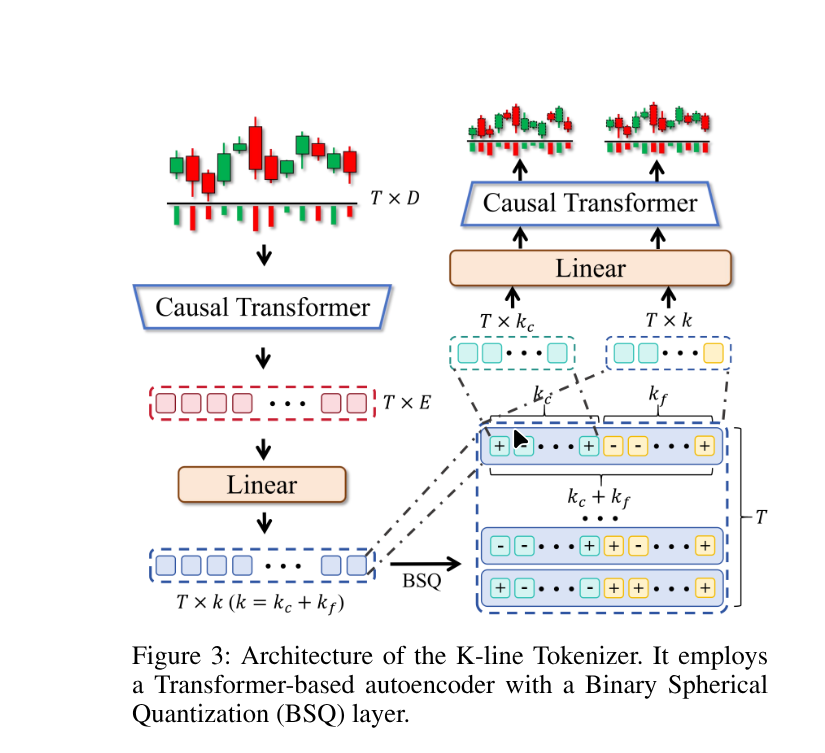
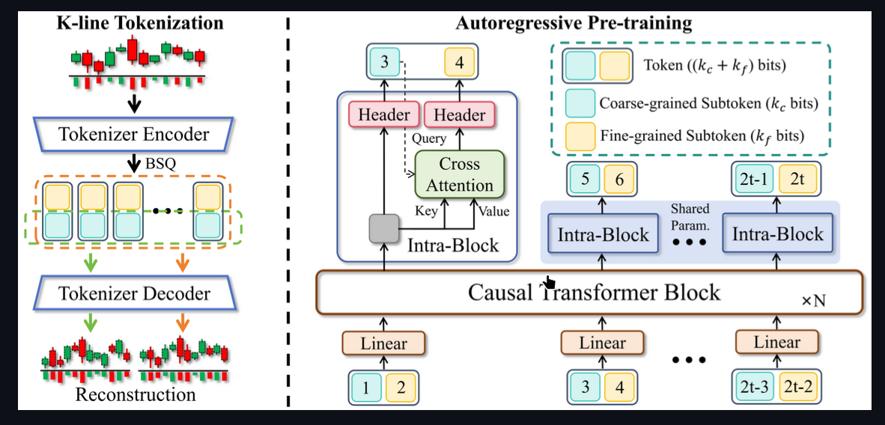
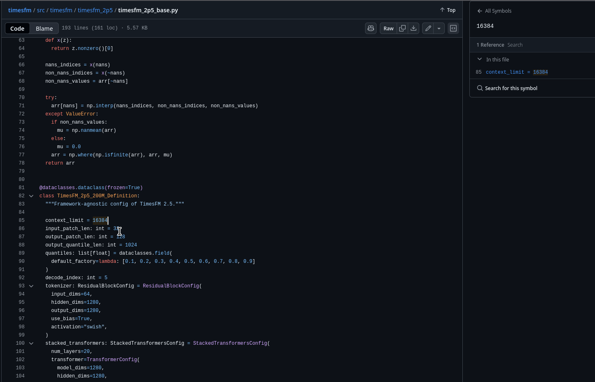

## Better Positional embedding :

### YaRN (Yet another RoPE extension, 2024)
 - Used in Mistral-7B-Instruct-v0.2, LLaMA-3 etc.
 - Fixes the numerical instability and poor extrapolation of RoPE for >32k tokens.
 - Combines linear scaling with smoother rotation frequency interpolation.
 - Best drop-in replacement for long-context RoPE models.
  
### LongRoPE (2024)
- Introduces a re-parameterized RoPE and dynamic frequency scaling.
- Enables models like LongLLaMA to reach 1M-token context length.
- Significantly better retention for very long documents.

## **Clearly the Kronos paper only makes use of the previous 512 data points that can be 5 minutes tick data points, or 10 mins, 1 hr, or 1 day data points, based on that we are only capturing very little span of the lookback to predict the next values.**

## **Because we have a high frequency data of nse, nifity 50 for the past 5 years. we can make use of this high frequency information and have longer context length to forcaste even more precisely**

| Use Case                     | Recommended PE           | Notes                          |
| ---------------------------- | ------------------------ | ------------------------------ |
| Long Context (>32k)          | **YaRN** or **LongRoPE** | Best extrapolation & stability |
| Drop-in RoPE improvement     | **XPOS**                 | Minimal change, very stable    |
| Simplicity + Efficiency      | **ALiBi**                | Great for decoding-only models |
| Encoder-Decoder tasks        | **T5 Relative Bias**     | Proven & robust                |
| Research / New Architectures | **DeltaPE** or **NPE**   | Promising next-gen encodings   |

## BSQ Alternatives :

| # | Paper / Method                                                                                                                           | Date                              | Compression / Approach                                                                                                         | Key Claims                                                                                                                                                             | Notes & Trade-offs                                                                                                        |
| - | ---------------------------------------------------------------------------------------------------------------------------------------- | --------------------------------- | ------------------------------------------------------------------------------------------------------------------------------ | ---------------------------------------------------------------------------------------------------------------------------------------------------------------------- | ------------------------------------------------------------------------------------------------------------------------- |
| 1 | Mixed‑Precision Embeddings for Large‑Scale Recommendation Models (MPE)                                                                   | Sept 2024 ([arXiv][1])            | “Mixed‐precision embeddings” → grouping features by frequency, selecting precision per group (e.g., some 4-, 8-, 16-bit)       | On large recommendation datasets: ~200× compression without much accuracy loss ([arXiv][1])                                                                            | Targeted at recommender embedding tables; may need adaptation for retrieval embeddings.                                   |
| 2 | CARVQ: Corrective Adaptor with Group Residual Vector Quantization for LLM Embedding Compression                                          | Oct 2025 (pre-print) ([arXiv][2]) | Residual vector quantization + corrective adaptor, down to ~1.6 bits per parameter                                             | Demonstrated on LLM embedding layers (e.g., LLaMA-3) with reasonable loss in perplexity / accuracy                                                                     | Recent and more focused on LLM embedding layers rather than retrieval index; implementation may be more complex.          |
| 3 | Optimization of Embeddings Storage for RAG Systems using Quantization and Dimensionality Reduction Techniques                            | Apr 2025 ([Papers with Code][3])  | Combines: low-bit floats (float8), quantization (int8 / binary) + dimensionality reduction (PCA, autoencoder)                  | Found float8 + moderate PCA could give ~4× storage reduction with <0.3% performance degradation — outperforming int8 at same compression ratio ([Papers with Code][3]) | Very relevant for embedding storage in retrieval systems; QE trade-offs for recall/precision must be measured.            |
| 4 | (Can Be IGNORED) Efficient Document Retrieval by End‑to‑End Refining and Quantizing BERT Embedding with Contrastive Product Quantization (Contrastive PQ) | Oct 2022 ([arXiv][4])             | Product Quantization (PQ) on refined BERT embeddings with a contrastive loss, rather than simple binary/hashing                | Significant improvement over semantic hashing or earlier quantization baselines ([ACL Anthology][5])                                                                   | PQ methods may be more complex for indexing/search; sometimes latent space + codebook complexity increases.               |
| 5 | (This one is also old so can be ignored) Compact Token Representations with Contextual Quantization for Efficient Document Re‑ranking (Contextual Quantization, CQ)               | 2022 ([ACL Anthology][6])         | Codebook-based quantization for token embeddings in ranking, decouples document‐specific vs document‐independent contributions | Reported ~14× reduction in storage for contextual token reps, with small relevance degradation ([ACL Anthology][6])                                                    | Focus is token-level representations for re-ranking, not exactly full vector retrieval setup — but conceptually relevant. |

[1]: https://arxiv.org/abs/2409.20305?utm_source=chatgpt.com "Mixed-Precision Embeddings for Large-Scale Recommendation Models"
[2]: https://arxiv.org/abs/2510.12721?utm_source=chatgpt.com "CARVQ: Corrective Adaptor with Group Residual Vector Quantization for LLM Embedding Compression"
[3]: https://paperswithcode.com/paper/optimization-of-embeddings-storage-for-rag?utm_source=chatgpt.com "Optimization of embeddings storage for RAG systems using quantization and dimensionality reduction techniques | Papers With Code"
[4]: https://arxiv.org/abs/2210.17170?utm_source=chatgpt.com "Efficient Document Retrieval by End-to-End Refining and Quantizing BERT Embedding with Contrastive Product Quantization"
[5]: https://aclanthology.org/2022.emnlp-main.54.pdf?utm_source=chatgpt.com "Efficient Document Retrieval by End-to-End Refining and Quantizing"
[6]: https://aclanthology.org/2022.acl-long.51.pdf?utm_source=chatgpt.com "Compact Token Representations with Contextual Quantization for Efficient"

Kairos: Towards Adaptive and Generalizable Time Series Foundation Models
https://arxiv.org/pdf/2509.25826

# Google's latest paper
## TimesFM (Time Series Foundation Model) is a pretrained time-series foundation model developed by Google Research for time-series forecasting.

## https://github.com/google-research/timesfm

Google Research team has started working on this model from 2024 itself, they have made their current latest model 2.5 model which is a 200M parameter model.

They claim that they perform good on the Time search forcasting than their previous version which is a 500M parameter model.

Expected outcomes with the guide (Piyush Pandey sir)meeting is to decide on what to proceed with ?

and the question to ask are :

### Meeting questions for professor

- Scope and success criteria
  - What should be the primary success metric for this work: forecasting accuracy (RMSE/MAE), directional accuracy, or economic performance (e.g., Sharpe after transaction costs)?
  - Do you prefer a methodological contribution (novel PE or adaptation) or an empirical/application paper (showing improvement on Nifty forecasting using long-context PEs)?

- Data & preprocessing
  - Should I focus on a single frequency (e.g., 1-min) or test multiple granularities (1-min, 5-min, hourly, daily)?
  - Are exogenous features (macroeconomic indicators, news sentiment, order-book features) in-scope or should we focus on prices only for now?

- Models, PEs & baselines
  - Do you expect Kronos (512 lookback) as an explicit baseline? Any other baselines you want included (ARIMA, LSTM, classic Transformer, TimesFM)?
  - Are we allowed to use modern long-context PEs (YaRN, LongRoPE, ALiBi, XPOS) and pre-trained models like TimesFM? Which should I prioritize if compute is limited?
  - Is applying existing PEs and demonstrating improvements enough, or do you expect a new PE/variation as a primary contribution?

- Quick decisions (if time-limited)
  - If we can only run two experiments before the deadline, would you prefer: (A) Kronos vs Kronos+YaRN on 1-min data, or (B) TimesFM fine-tune vs long-context Transformer from scratch?

## Compact research plan to include in meeting materials

Goal: Evaluate whether long-context Transformers with modern positional embeddings improve short-term forecasting accuracy and economic value for Nifty-50 versus the Kronos 512-lookback baseline and other baselines.

Contract (short)
- Inputs: Nifty-50 price series (primary: 1-min), optional exogenous series (macro/news).
- Outputs: next-step (and optionally N-step) price/return forecasts, evaluation metrics (RMSE/MAE/directional accuracy)
- Success: Statistically significant improvement versus Kronos baseline on holdout; demonstrable economic value in a simple backtest.

- **Access to cleaned Nifty-50 1-min data for ~5 years (or highest frequency available)**.
<!-- - Access to at least one GPU (or cloud allocation) for manageable training; if not available, we will scale experiments. -->

Primary experiments
- Baselines:
  - Kronos (512 lookback) — replicate existing setup for fair comparison.
  - LSTM and short-context Transformer baselines.

- Long-context methods:
  - Transformer + YaRN (context sizes: 512, 4k, 32k as feasible).
  - Transformer + LongRoPE and ALiBi as comparisons.
  - TimesFM (pretrained) — fine-tune on the Nifty dataset.

Ablations
- PE variant comparison (YaRN vs LongRoPE vs ALiBi vs XPOS).
- Context length (512, 4k, 32k where feasible).
- Sampling frequency and lookback span (e.g., 512 points at 1-min vs 512 at 5-min — same token count, different time span).

