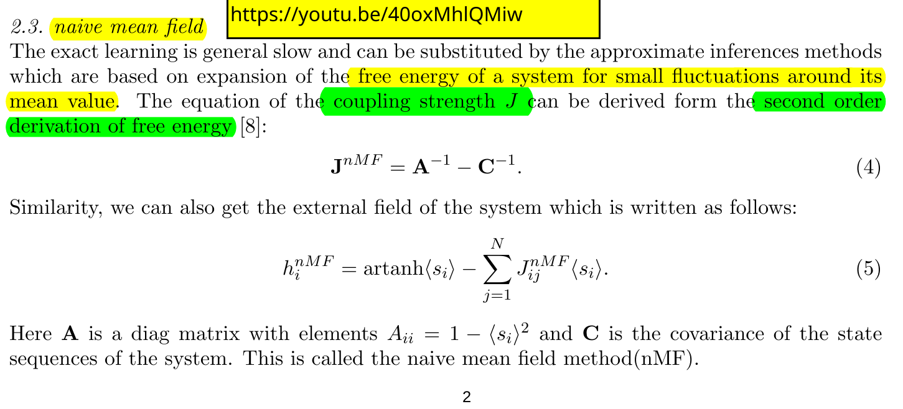

## Paper : The stock market learned as Ising model

explanation for how the below equations are formed:

### Step 1: Recap of the Ising Model and Mean Field Approximation

Let’s start by revisiting the **Ising model** and the **naive mean field approximation**, as they’re central to understanding the equations you provided.

- **Ising Model**:
  - Imagine a grid (like a checkerboard) where each square (site) has a spin \( S_i \), which can be \( +1 \) (up) or \( -1 \) (down). This could represent magnetic spins, opinions, or binary states.
  - The energy of the system depends on:
    - **Interactions between neighboring spins**: If neighboring spins \( S_i \) and \( S_j \) are aligned (both +1 or both -1), they lower the energy. If they’re opposite, they increase it. This is controlled by the **coupling strength** \( J \).
    - **External magnetic field**: An external field \( h \) encourages spins to align with it (e.g., all spins up if \( h > 0 \)).
  - The energy of the system is given by:
    \[
    E(\{S_i\}) = -h \sum_i S_i - J \sum_{\langle ij \rangle} S_i S_j
    \]
    - \( h \sum_i S_i \): Energy from the external field acting on each spin.
    - \( J \sum_{\langle ij \rangle} S_i S_j \): Energy from interactions between nearest neighbors (denoted by \( \langle ij \rangle \)).
    - \( J > 0 \) encourages neighboring spins to align (ferromagnetic case).

- **Why Is It Hard?**:
  - To compute properties like the average magnetization \( m = \langle S_i \rangle \) (average spin value), we need the probability of each configuration, given by the **Boltzmann distribution**:
    \[
    p(\{S_i\}) = \frac{\exp(-\beta E(\{S_i\}))}{Z}
    \]
    where \( \beta = 1/(kT) \) (inverse temperature, \( k \) is Boltzmann’s constant), and \( Z \) is the partition function (normalizing constant).
  - Computing \( Z \) is hard because it involves summing over *all possible spin configurations* (e.g., \( 2^N \) for \( N \) spins), which is intractable for large systems, especially in 3D or with loops in the interaction graph.

- **Naive Mean Field Approximation**:
  - To make calculations easier, we assume spins are **independent** (no direct interactions between them).
  - Instead of considering the actual value of a neighbor’s spin \( S_j \), we replace it with its **average value** \( \langle S_j \rangle = m \), where \( m \) is the magnetization per spin.
  - This simplifies the energy for a single spin \( S_j \):
    \[
    \epsilon(S_j) = -h S_j - J S_j \sum_{k \in \text{n.n.}} S_k
    \]
    becomes:
    \[
    \epsilon_{\text{mf}}(S_j) = -h S_j - J S_j \sum_{k \in \text{n.n.}} \langle S_k \rangle = -h_{\text{mf}} S_j
    \]
    where the **effective field** is:
    \[
    h_{\text{mf}} = h + J z m
    \]
    - \( z \): Number of nearest neighbors (e.g., 4 for a 2D square lattice, 6 for a 3D cubic lattice).
    - \( m \): Average magnetization per spin.

- **Key Idea**: We treat each spin as if it’s in a “mean field” created by the average effect of its neighbors, ignoring correlations between spins (i.e., assuming \( \langle S_i S_j \rangle \approx \langle S_i \rangle \langle S_j \rangle \)).

---

### Step 2: What Is Free Energy and Why Use It?

The equations you provided (\( J_{\text{nMF}} = A^{-1} - C^{-1} \) and the external field equation) come from a **free energy** approach. Let’s understand what free energy is and why it’s relevant.

- **Free Energy in Statistical Physics**:
  - The **Helmholtz free energy** \( F \) of a system is defined as:
    \[
    F = -kT \ln Z
    \]
    where \( Z \) is the partition function:
    \[
    Z = \sum_{\{S_i\}} \exp(-\beta E(\{S_i\}))
    \]
  - Free energy is crucial because it connects to thermodynamic properties:
    - The average magnetization, susceptibility, and other quantities can be derived by taking derivatives of \( F \).
    - For example, the magnetization \( m \) is related to the derivative of \( F \) with respect to the external field \( h \).

- **Why Approximate Free Energy?**:
  - Computing \( Z \) exactly is intractable for the Ising model in 3D due to the huge number of configurations.
  - In mean field theory, we approximate the system’s behavior by assuming spins are independent, which simplifies the calculation of \( Z \) and thus \( F \).
  - The document mentions that exact learning (computing exact probabilities) is slow, so we use **approximate inference methods** based on expanding the free energy around small fluctuations from the mean.

- **Fluctuations Around the Mean**:
  - In the mean field approximation, we assume each spin \( S_i \) fluctuates around its average value \( \langle S_i \rangle = m \).
  - We model the system as if each spin feels an effective field \( h_{\text{mf}} \), and we compute probabilities assuming independence.
  - The “expansion of free energy for small fluctuations” means we approximate the free energy by considering small deviations of spins from their average values, which leads to simpler equations.

---

### Step 3: Deriving the Coupling Strength \( J_{\text{nMF}} = A^{-1} - C^{-1} \)

Now, let’s tackle the first equation you provided:
\[
J_{\text{nMF}} = A^{-1} - C^{-1}
\]
where:
- \( A \): A diagonal matrix with elements \( A_{ii} = 1 - \langle S_i \rangle^2 \).
- \( C \): The covariance matrix of the spin states.

This equation is about estimating the **coupling strength** \( J \) (how strongly neighboring spins influence each other) using the mean field approximation. Let’s break it down.

#### Step 3.1: Understanding \( A \) and \( C \)

- **Matrix \( A \)**:
  - \( A \) is a diagonal matrix, meaning \( A_{ij} = 0 \) for \( i \neq j \), and the diagonal elements are:
    \[
    A_{ii} = 1 - \langle S_i \rangle^2
    \]
  - Since \( S_i = \pm 1 \), the average \( \langle S_i \rangle = m \) (magnetization) is between -1 and 1.
  - Thus, \( \langle S_i \rangle^2 = m^2 \), and:
    \[
    A_{ii} = 1 - m^2
    \]
  - This term represents the **variance** of a single spin. Since \( S_i^2 = 1 \) (because \( (+1)^2 = 1 \), \( (-1)^2 = 1 \)), the variance is:
    \[
    \langle S_i^2 \rangle - \langle S_i \rangle^2 = 1 - m^2
    \]
  - So, \( A_{ii} = 1 - m^2 \) measures how much spin \( S_i \) fluctuates around its mean \( m \). If \( m = 0 \) (no magnetization, spins are equally likely to be up or down), \( A_{ii} = 1 \). If \( m = \pm 1 \) (all spins aligned), \( A_{ii} = 0 \) (no fluctuations).

- **Matrix \( C \)**:
  - \( C \) is the **covariance matrix** of the spins, with elements:
    \[
    C_{ij} = \langle (S_i - \langle S_i \rangle)(S_j - \langle S_j \rangle) \rangle = \langle S_i S_j \rangle - \langle S_i \rangle \langle S_j \rangle
    \]
  - This measures the **correlations** between spins \( S_i \) and \( S_j \).
  - In the mean field approximation, we assume spins are independent, so for \( i \neq j \):
    \[
    \langle S_i S_j \rangle \approx \langle S_i \rangle \langle S_j \rangle = m^2
    \]
    which makes \( C_{ij} \approx 0 \) for \( i \neq j \). For \( i = j \):
    \[
    C_{ii} = \langle S_i^2 \rangle - \langle S_i \rangle^2 = 1 - m^2
    \]
    So, in the naive mean field, \( C \) is also approximately diagonal, with \( C_{ii} = 1 - m^2 \).

- **Inverse Matrices**:
  - \( A^{-1} \): Since \( A \) is diagonal with \( A_{ii} = 1 - m^2 \), the inverse is:
    \[
    A^{-1}_{ii} = \frac{1}{1 - m^2}
    \]
  - \( C^{-1} \): If we assume \( C \) is diagonal in the mean field approximation (due to independence), then:
    \[
    C^{-1}_{ii} = \frac{1}{1 - m^2}
    \]
  - However, in practice, \( C \) may include small off-diagonal terms (correlations) depending on how the covariance is computed from data or the model.

#### Step 3.2: Free Energy Expansion

The document states that \( J_{\text{nMF}} \) is derived from the **second-order derivative of the free energy**. Here’s the intuition:

- The **free energy** \( F \) is related to the partition function \( Z \):
  \[
  F = -kT \ln Z
  \]
- In mean field theory, we approximate \( Z \) by assuming spins are independent, so:
  \[
  Z_{\text{mf}} = \prod_i \sum_{S_i = \pm 1} \exp(-\beta \epsilon_{\text{mf}}(S_i))
  \]
  where \( \epsilon_{\text{mf}}(S_i) = -h_{\text{mf}} S_i \), and \( h_{\text{mf}} = h + J z m \).

- The free energy in the mean field approximation is:
  \[
  F_{\text{mf}} = -kT \sum_i \ln \left( \sum_{S_i = \pm 1} \exp(\beta h_{\text{mf}} S_i) \right)
  \]
  For a single spin:
  \[
  \sum_{S_i = \pm 1} \exp(\beta h_{\text{mf}} S_i) = \exp(\beta h_{\text{mf}}) + \exp(-\beta h_{\text{mf}}) = 2 \cosh(\beta h_{\text{mf}})
  \]
  So:
  \[
  F_{\text{mf}} = -N kT \ln \left( 2 \cosh(\beta h_{\text{mf}}) \right)
  \]
  where \( N \) is the number of spins.

- To estimate \( J \), we consider how the free energy changes with respect to the interactions. The **second-order derivative** of \( F \) with respect to model parameters (like \( J \)) is related to the **susceptibility** or correlations in the system.

- In the mean field approximation, the **inverse susceptibility** is related to the matrices \( A \) and \( C \):
  - \( A_{ii} = 1 - m^2 \) reflects the variance of individual spins.
  - \( C_{ij} \) reflects correlations (or lack thereof in mean field).
  - The equation \( J_{\text{nMF}} = A^{-1} - C^{-1} \) comes from a method called the **inverse Ising problem**, where we infer the coupling \( J \) from observed spin statistics (means and correlations).
  - Specifically, the **second derivative of the free energy** with respect to spin variables gives the **inverse covariance matrix**, which is adjusted to account for the mean field assumption.

#### Step 3.3: Intuition for \( J_{\text{nMF}} \)

- The equation \( J_{\text{nMF}} = A^{-1} - C^{-1} \) is a way to estimate \( J \) by comparing the expected correlations under the mean field assumption to the actual correlations in the system.
- If \( C \) is diagonal (as in naive mean field, assuming no correlations), then \( A^{-1} - C^{-1} \) simplifies, but in practice, \( C \) may include small correlations from data, leading to a non-trivial difference.
- This equation is derived from maximizing the likelihood of observed spin configurations, approximated by the mean field model, and involves the second derivatives of the free energy (related to the curvature of the probability distribution).

---

### Step 4: Deriving the External Field \( h_{\text{nMF}} \)

Now, let’s address the second equation:
\[
h_{\text{nMF},i} = \text{artanh}(\langle S_i \rangle) - \sum_{j=1}^N J_{ij,\text{nMF}} \langle S_j \rangle
\]

#### Step 4.1: Magnetization and Consistency

In the mean field approximation, the magnetization \( m = \langle S_i \rangle \) satisfies the self-consistent equation (from the previous context):
\[
m = \tanh(\beta h_{\text{mf}})
\]
where:
\[
h_{\text{mf}} = h + J z m
\]
- Solving for \( h_{\text{mf}} \):
  \[
  \text{artanh}(m) = \beta h_{\text{mf}} = \beta (h + J z m)
  \]
  \[
  h_{\text{mf}} = \frac{1}{\beta} \text{artanh}(m)
  \]
- Substitute \( h_{\text{mf}} = h + J z m \):
  \[
  h + J z m = \frac{1}{\beta} \text{artanh}(m)
  \]
  \[
  h = \frac{1}{\beta} \text{artanh}(m) - J z m
  \]
- In the document’s notation, \( \langle S_i \rangle = m \), and the sum over neighbors is generalized to all spins with couplings \( J_{ij} \):
  \[
  h_i = \frac{1}{\beta} \text{artanh}(\langle S_i \rangle) - \sum_j J_{ij} \langle S_j \rangle
  \]
- Since \( \beta = 1/(kT) \), the factor \( \frac{1}{\beta} = kT \), so:
  \[
  h_{\text{nMF},i} = kT \text{artanh}(\langle S_i \rangle) - \sum_j J_{ij,\text{nMF}} \langle S_j \rangle
  \]
  (The document omits the \( kT \) factor, possibly assuming \( k = 1 \) or a different normalization.)

#### Step 4.2: Intuition for \( h_{\text{nMF}} \)

- The external field \( h_i \) is the field needed at site \( i \) to produce the observed magnetization \( \langle S_i \rangle \), given the interactions with other spins.
- The term \( \text{artanh}(\langle S_i \rangle) \) comes from inverting the magnetization equation \( m = \tanh(\beta h_{\text{mf}}) \).
- The term \( -\sum_j J_{ij,\text{nMF}} \langle S_j \rangle \) subtracts the contribution of the interactions with other spins (the mean field from neighbors), leaving only the external field \( h_i \).

---

### Step 5: Why These Equations?

- **Why Free Energy Expansion?**:
  - The mean field approximation simplifies the Ising model by assuming spins are independent, but we still need to estimate parameters like \( J \) and \( h \) to match observed data (e.g., average magnetizations \( \langle S_i \rangle \) and correlations \( \langle S_i S_j \rangle \)).
  - The free energy provides a framework to compute these parameters by maximizing the likelihood of the observed spin statistics.
  - The **second-order expansion** of the free energy around the mean values gives us information about correlations and susceptibilities, which are used to derive \( J_{\text{nMF}} \).

- **Why \( A^{-1} - C^{-1} \)?**:
  - This comes from the **inverse Ising problem**, where we infer \( J_{ij} \) from observed correlations.
  - The matrix \( A \) (diagonal, with \( 1 - m^2 \)) represents the variance of individual spins under the mean field assumption.
  - The matrix \( C \) (covariance) captures actual correlations in the system (or approximations thereof).
  - The difference \( A^{-1} - C^{-1} \) adjusts the couplings to account for discrepancies between the mean field assumption (no correlations) and the actual system (small correlations).

- **Why the External Field Equation?**:
  - The equation for \( h_{\text{nMF},i} \) ensures that the effective field at each site produces the observed magnetization, consistent with the mean field approximation.
  - It balances the external field \( h \) with the interaction effects from neighboring spins.

---

### Step 6: Connecting to the Previous Context

The equations tie back to the earlier document on **Probabilistic Graphical Models** and the **Mean Field Approximation**:

- In the earlier document, the mean field approximation was used to simplify the **Boltzmann distribution**:
  \[
  p(X) = \frac{\exp\left( \sum_{i<j} \theta_{ij} X_i X_j + \sum_i \theta_i X_i \right)}{Z}
  \]
  This is equivalent to the Ising model’s energy function, where \( \theta_{ij} = \beta J_{ij} \) and \( \theta_i = \beta h_i \).

- The naive mean field update in the earlier document:
  \[
  q_i(X_i) \propto \exp\left( \theta_i X_i + \sum_{j \in N_i} \theta_{ij} X_i \langle X_j \rangle_{q_j} \right)
  \]
  is analogous to the Ising model’s mean field, where \( \langle X_j \rangle = m \) and the effective field includes contributions from neighbors.

- The free energy approach in the second document formalizes this by deriving \( J \) and \( h \) to match observed statistics, using the second-order expansion to handle fluctuations.

---

### Step 7: Limitations and Intuition

- **Why Approximate?**:
  - Exact solutions for the Ising model are only possible in 1D or 2D (with special techniques). In 3D, approximations like mean field are necessary.
  - The naive mean field ignores correlations (\( \langle S_i S_j \rangle \approx \langle S_i \rangle \langle S_j \rangle \)), which leads to errors, especially near the critical temperature \( T_c \), where correlations become significant.

- **Why These Equations Work**:
  - They provide a way to estimate \( J \) and \( h \) from data (e.g., observed magnetizations and correlations) under the mean field assumption.
  - The free energy expansion captures the leading behavior of the system, assuming small fluctuations around the mean.

---

### Step 8: Check-In

Does this explanation clarify how we arrived at the equations for \( J_{\text{nMF}} \) and \( h_{\text{nMF}} \)? Here’s a quick summary:

- The **naive mean field approximation** simplifies the Ising model by assuming spins are independent, replacing neighbor interactions with their average effect.
- The **free energy** is approximated, and its second-order derivatives give us the coupling strength \( J_{\text{nMF}} = A^{-1} - C^{-1} \), where \( A \) and \( C \) describe spin variances and correlations.
- The external field \( h_{\text{nMF},i} \) is derived to ensure the observed magnetization is consistent with the mean field effective field.

If you’re comfortable with this, we can move to the **Topic Models** and **Latent Dirichlet Allocation (LDA)** from the first document, or dive deeper into any part of the Ising model or mean field theory. Let me know what you’d like to explore next!

