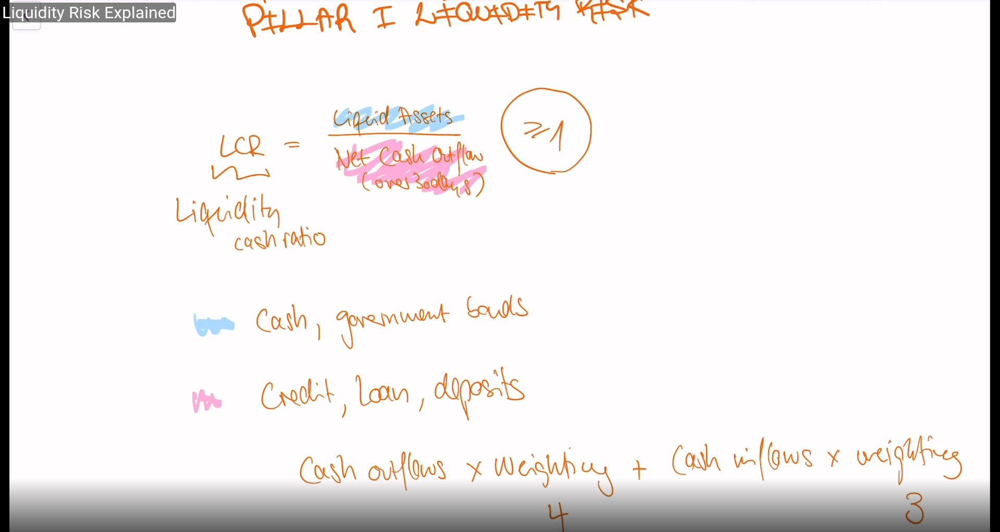
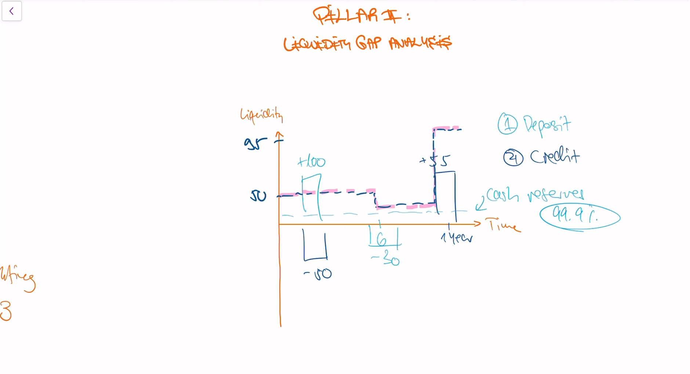
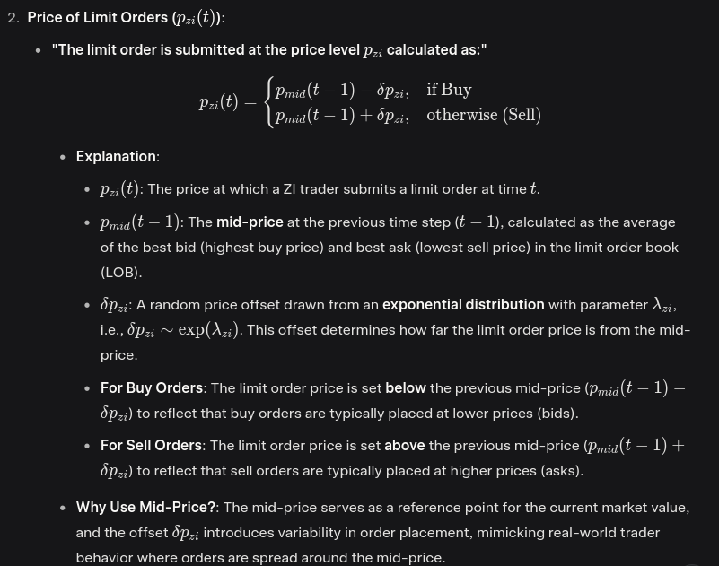
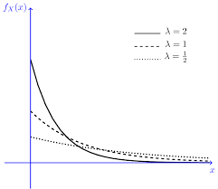

# Agent-based Liquidity Risk Modelling for Financial Markets

## Overview and Objective

The paper addresses the challenge of modeling liquidity risk, which arises from the price impact and transaction costs incurred when buying or selling large quantities of an asset in financial markets. Liquidity risk is critical for financial institutions, such as banks and exchanges, that need to manage cash flow, collateral, or margin requirements, especially during large position liquidations. The authors propose an ABM framework that simulates realistic market behaviors, focusing on the Hang-Seng Futures Index as a case study, to calculate transaction costs and optimize execution strategies under liquidity risk.

---

## Key Concepts

### 1. Liquidity Risk and Price Impact

- **Liquidity risk** refers to the uncertainty and cost associated with executing trades, particularly for large orders (meta-orders), due to market slippage.
- **Price impact** has two components:
  - **Transient impact**: Temporary price changes due to immediate market reactions.
  - **Permanent impact**: Lasting price shifts as markets reassess value based on trade information.
- The paper highlights the **square-root law**, where price impact scales with the square root of order size.
- 
- 

### 2. Agent-Based Modeling (ABM)

- Simulates individual agents (traders, exchanges) with specific behaviors.
- Uses a realistic market structure **(Continuous Double Auction).**

  - the simulation of a financial market using a **Continuous Double Auction (CDA)** mechanism, which is a widely used trading system in real-world financial exchanges. This approach enhances the realism of the ABM by mimicking how actual markets operate. Here's a breakdown of its meaning:

  ### **Continuous Double Auction (CDA)**

  A Continuous Double Auction is a market mechanism where:

  * **Buyers and sellers** submit orders (bids to buy, asks to sell) continuously throughout the trading session.
  * **Orders are matched in real-time** based on  **price-time priority** :
    * **Price priority** : The highest bid (buy order) and lowest ask (sell order) are prioritized for matching.
    * **Time priority** : If multiple orders have the same price, the earliest submitted order is executed first.
  * **Limit Order Book (LOB)** : Unmatched orders are stored in a limit order book, with buy orders (bids) and sell orders (asks) organized by price levels.
  * **Order Types** :
  * **Limit Orders** : Specify a price and quantity, queued in the LOB until matched or canceled.
  * **Market Orders** : Executed immediately at the best available price.
  * **Trading is continuous** : Unlike periodic auctions (e.g., opening/closing call auctions), trades can occur at any time during the trading session as long as matching orders exist.
- Captures dynamics like **fat tails and volatility clustering.**

### 3. Zero-Intelligence (ZI) Model

- Traders submit **random limit and market orders via probabilistic rules (Poisson arrivals, exponential pricing**).
- Provides **baseline behavior**, enhanced with more realistic traders in this paper.

---

## Methodology

The ABM framework includes **exchange mechanics** and **trader behaviors**, calibrated to historical market data and evaluated using Monte-Carlo simulations.

### 1. Model Structure

#### Exchange Mechanics

- Simulates a Continuous Double Auction (CDA) with a **limit order book** (LOB).
- Traders submit limit or market orders prioritized by price and time.
- Discrete **time steps of 20ms simulate high-frequency trading** (09:15–16:30).

#### Data Calibration

- Uses tick-level data from **Hang-Seng Index Futures** (HSIZ2, Dec 23, 2022).
- Contains **3.4M limit order operations and 85k trade**s.
- Estimates parameters like order arrival rates

  $$
  \alpha(t), \mu(t)
  $$

  and samples prices, volumes, durations conditionally on spread and time of day.

### 2. Trader Behaviors

The ABM extends ZI with **Chiarella(pronounced chiarel-la or kyarel-la) traders**, representing:

ZI traders are simplistic agents that submit **orders (buy or sell) randomly**, **without considering the market's state** (e.g., price trends, order book depth). Despite their simplicity, ZI traders can reproduce certain statistical properties of real markets, such a**s fat-tailed return distributions**, when combined with a realistic market structure like a **Continuous Double Auction (CDA)**. The paper uses the ZI model as a starting point and builds upon it with more complex trader behaviors (e.g., Chiarella traders).

the reason why the p_zi is close to p_mid if lambda is high and why is it far from is p_mid if lambda is low can be clearly check from this above image.

#### Fundamental Traders

- Trade based on the difference between market price and **reflexive fundamental value**

  $$
  \tilde{V}_t
  $$

  , defined as:

  $$
  \tilde{V}_t = V_t + X_t
  $$
- Demand function:

  $$
  D_f(t) = \kappa (\tilde{V}_t - p_{ba/bb}(t))
  $$

#### Momentum Traders

- Trade based on price trends. Demand:

  $$
  D_M(t) = \beta \tanh(\gamma M(t))
  $$
- Includes high-frequency (

  $$
  \eta_H
  $$

  ) and low-frequency (

  $$
  \eta_L
  $$

  ) types.

#### Noise Traders

- Trade randomly. Demand:

  $$
  D_N(t) = \sigma \zeta \quad \text{where } \zeta \sim N(0,1)
  $$

#### Order Submission

- Traders submit:
  - Limit orders:
    $$
    \alpha(t)D(t)
    $$
  - Market orders:
    $$
    \mu(t)D(t)
    $$

### 3. Market Impact and Transaction Costs

#### Single-Trade Impact

- Modeled as:

  $$
  f_{mi}(Q) = \lambda Q^\gamma
  $$

  where

  $$
  \gamma = 0.5
  $$

  (square-root law), and

  $$
  Q
  $$

  is the order volume.

#### Transaction Cost (Implementation Shortfall)

$$
\zeta = \frac{\sum_t p_t v_t^E}{\sum_t v_t^E} - p_R
$$

- $ p_t $: executed price
- $ v_t^E $: executed volume
- $ p_R $: reference price (e.g., mid-price)

Breakdown:

- **Market Risk**:

  $$
  \zeta_{MR}
  $$

  — price fluctuation unrelated to the order.
- **Market Impact**:

  $$
  \zeta_{MI}
  $$

  — price shift caused by the order itself (via counterfactual simulation).

#### Liquidity Risk Surface

- Monte-Carlo simulation across order sizes and time horizons.
- Shows:
  - Costs increase concavely with order size (square-root law).
  - Costs decrease with longer execution horizons.

### 4. Calibration and Optimization

#### Chiarella Parameter Tuning

- Optimized using **surrogate modeling** to match stylized facts (order rates, spread, return autocorrelation).

#### Optimal Execution

- Based on **Almgren-Chriss** framework:

  $$
  \min \; E(x) + \lambda V(x)
  $$
- Strategies:

  - **Front-loaded** (e.g., 70% day 1)
  - **Balanced** (e.g., 20% per day)
  - **Back-loaded**

---

## Key Findings

### 1. Emergent Market Impact

- Transient and permanent impacts **emerge naturally** from trader behavior and reflexive valuation.
- Simulated impacts follow **square-root law**, as observed empirically.

### 2. Liquidity Risk Surface

- Captures:
  - Higher cost for larger/shorter orders.
  - Cost variability with horizon.
  - Horizon effects absent in Bloomberg TCA models.

### 3. Optimal Execution

- Replicates Almgren-Chriss results:

  - **Front-loaded**: high cost, low variance.
  - **Balanced**: near-optimal.
  - **Back-loaded**: suboptimal under no-drift.
- ABM allows flexible strategy testing, including combined order types.

### 4. Practical Application

- Applied to Hang-Seng Futures Index (HSIZ2).
- Useful for:
  - Exchange risk scenarios (e.g., participant default).
  - Liquidity risk managers planning large trades.

---

## Implications

### For Exchanges

- Helps simulate default scenarios and optimize liquidation during close-out.
- Supports systemic risk mitigation by CCPs.

### For Liquidity Risk Managers

- Evaluates risk under different execution schedules and market states.
- Useful for stress testing large trades and policy evaluation.

### Advantages Over Traditional Models

- No unrealistic assumptions (vs Kyle, Almgren-Chriss).
- Captures microstructure realism, adaptive behaviors, and nonlinear impacts.
- Extensible to policy simulations and multi-asset modeling.

---

## Limitations and Future Work

### Limitations

- Historical calibration may miss black swan events.
- Traders rely on limited LOB features.
- Single-trade impact model less effective in low-liquidity markets.

### Future Work

- Use deep neural networks to estimate order parameters from richer LOB data (top 10 levels, flow imbalance).
- Improve robustness for illiquid markets.
- Extend to **multi-asset simulations**.

---

## Conclusion

The paper introduces a high-fidelity ABM for liquidity risk modeling using realistic trader behaviors and exchange mechanics. Calibrated to real data and using Monte-Carlo simulations, the model reproduces empirical patterns like the square-root impact law and allows for optimized execution strategies. Its application to Hang-Seng Futures shows both theoretical rigor and practical utility.

---

## Simplified Takeaways

- **What**: An ABM simulates market behavior to model liquidity risk and execution cost.
- **How**: Combines CDA exchange and Chiarella trader types with reflexive pricing.
- **Key Results**: Emergent square-root law, liquidity surface, and optimal execution.
- **Why It Matters**: Enhances liquidity risk management and execution planning beyond traditional models.
