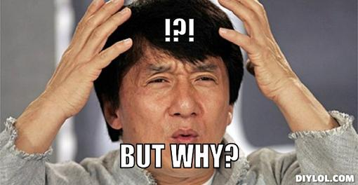
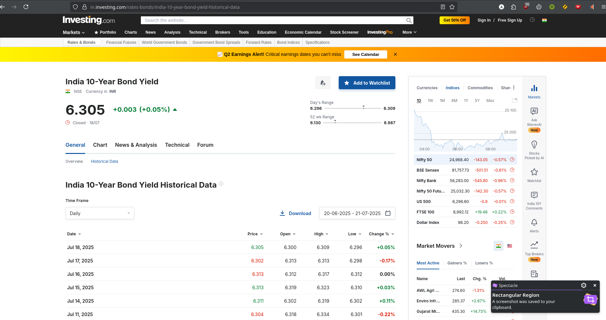
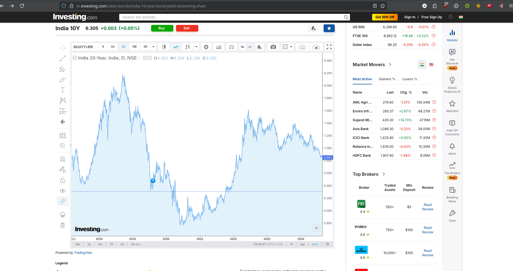

# But why ?? traditional modeling → ABMs

The shift from traditional modeling to Agent-Based Modeling (ABM) in financial markets is driven by the limitations of traditional approaches and the unique capabilities of ABMs to capture **complex, heterogeneous, and dynamic behaviors**. Below, I first explain the technical and mathematical reasons for this transition, focusing on why traditional models fall short and how ABMs address these shortcomings. Then, I provide a detailed technical analysis of ABMs in terms of mathematics, optimization, stochasticity, and other relevant parameters, drawing on insights from the research papers and general ABM methodologies in financial markets.

---

### **Why Move from Traditional Modeling to ABMs?**

Traditional modeling approaches, such as **equilibrium-based models** (e.g., **Capital Asset Pricing Model** (CAPM), Black-Scholes), econometric models (e.g., GARCH for volatility), or aggregate macroeconomic models (e.g., DSGE models), have been widely used in financial markets. However, their limitations have prompted a shift to ABMs for the following technical reasons:

watched this [video for capm](https://youtu.be/XIXd7pUt4cg) 

1. **Inability to Model Heterogeneity**:

   - **Traditional Models**: Assume homogeneous agents and rely on representative agent frameworks. For example, CAPM assumes all investors follow mean-variance optimization:
     here Rf is risk free rate

     $$
     E(R_i) = R_f + \beta_i (E(R_m) - R_f)
     $$

     
   - for india Rf is currently 6.305%.

     
   - 
   - **ABM Advantage**: ABMs model heterogeneous agents with **distinct strategies**:

     $$
     U_i(t) = f(p_t, \theta_i, I_i(t))
     $$

     * **ABM** is a computational modeling approach where individual agents (e.g., people, firms, or entities) are explicitly modeled with their own behaviors, decisions, and interactions. These agents follow rules, and the system's behavior emerges from their collective actions.
     * **Heterogeneous agents** means that each agent i i **i** has unique characteristics, preferences, or states, unlike models where all agents are identical (homogeneous).

     The equation $U_i(t) = f(p_t, \theta_i, I_i(t))$ typically represents the utility function (or decision-making criterion) for agent $i$ at time $t$. Here's what each component means:

     ---

     ## 2. Breaking Down the Equation

     - **$U_i(t)$**: This is the utility (or payoff, satisfaction, or objective function) of agent $i$ at time $t$. It quantifies how "good" a certain state or decision is for the agent. In ABM, agents often make decisions to maximize their utility.
     - **$f(\cdot)$**: This is a function that determines how the inputs (below) combine to produce the agent's utility. The specific form of $f$ depends on the model (e.g., linear, logarithmic, or complex).
     - **$p_t$**: This represents the environment or external conditions at time $t$, which are typically shared across all agents. Examples include:

       - Market prices (e.g., price of goods or services)
       - Macroeconomic variables (e.g., interest rates, inflation)
       - Social or environmental factors (e.g., public policies, resource availability)

       In ABM, $p_t$ often evolves dynamically based on agents' collective actions.
     - **$\theta_i$**: This captures the agent-specific characteristics or preferences of agent $i$. These are typically fixed or slowly changing and reflect heterogeneity. Examples include:

       - Risk aversion levels
       - Personal preferences (e.g., for certain goods or behaviors)
       - Intrinsic traits (e.g., wealth, skills, or beliefs)

       This is what makes agents heterogeneous, as each agent $i$ has a unique $\theta_i$.
     - **$I_i(t)$**: This represents the agent-specific state or information of agent $i$ at time $t$. It is dynamic and can change over time. Examples include:

       - Current wealth or income
       - Knowledge or beliefs about the environment
       - Inventory levels, health status, or social connections

       This term captures how an agent's situation evolves in the simulation.

     ---

     ## 3. What Does This Equation Do in ABM?

     In an ABM, this equation defines how each agent evaluates their situation or makes decisions at time $t$. Here’s how it typically works:

     - Each agent $i$ uses $U_i(t)$ to assess the desirability of different actions (e.g., buying, selling, investing, or cooperating).
     - The utility depends on:
       - **External conditions ($p_t$)**: Shared factors that all agents consider.
       - **Agent-specific traits ($\theta_i$)**: What makes each agent unique.
       - **Agent-specific state ($I_i(t)$)**: The agent's current situation, which may change due to their actions or interactions.

     Agents may try to **maximize $U_i(t)$** by choosing actions. For example, in an economic model, they might decide how much to consume or invest.

     The **heterogeneity** comes from differences in $\theta_i$ and $I_i(t)$, meaning each agent evaluates the same environment ($p_t$) differently, leading to diverse behaviors.

     ---

     ## 4. Example: Economic ABM

     Imagine an ABM simulating consumers in a market:

     - $p_t$: The price of a good at time $t$
     - $\theta_i$: Agent $i$'s preference for the good
     - $I_i(t)$: Agent $i$'s wealth at time $t$
     - $U_i(t)$: The utility agent $i$ gets from consuming the good

     The function $f$ could be something like:

     $$
     U_i(t) = \theta_i \cdot \text{quantity consumed} - p_t \cdot \text{cost}
     $$

     ...subject to the constraint:

     $$
     \text{cost} \leq I_i(t)
     $$

     In this model:

     - Agents with high $\theta_i$ (strong preference) might buy more, even if prices ($p_t$) are high.
     - Agents with low $I_i(t)$ (little wealth) might buy less or nothing.
     - As agents buy or sell, $p_t$ might change (e.g., high demand increases prices), affecting future utilities.
2. **Failure to Capture Non-Linear Dynamics and Emergent Phenomena**:

   - **Traditional Models**: Use linear models or equilibrium assumptions, e.g., the Black-Scholes model:

     $$
     dS_t = \mu S_t \, dt + \sigma S_t \, dW_t
     $$
   - **ABM Advantage**: Emergent prices from agent interaction:

     $$
     p_t = f(\{D_i(t), S_i(t)\}_{i=1}^N)
     $$
3. **Limited Handling of Stochasticity and Uncertainty**:

   - **Traditional Models**: GARCH for volatility:

     $$
     \sigma_t^2 = \alpha_0 + \alpha_1 \epsilon_{t-1}^2 + \beta_1 \sigma_{t-1}^2
     $$
   - **ABM Advantage**: Stochastic processes at agent level, e.g., neural point processes:

     $$
     \lambda(t) = f(t, H_t, \theta)
     $$

     # Comparing GARCH and ABM for Handling Stochasticity and Uncertainty

     The comparison focuses on how **traditional models** (like GARCH) and **agent-based models (ABMs)** handle **stochasticity and uncertainty** in financial or economic modeling. Below, we explain the two approaches, emphasizing their respective equations and their significance.

     ## 1. Traditional Models: GARCH for Volatility

     **Equation** :
     $ \sigma_t^2 = \alpha_0 + \alpha_1 \epsilon_{t-1}^2 + \beta_1 \sigma_{t-1}^2 $

     ### Explanation

     * **What is GARCH?**
       GARCH (Generalized Autoregressive Conditional Heteroskedasticity) is a statistical model used to estimate and forecast **time-varying volatility** in financial time series, such as stock prices or returns. Unlike models assuming constant volatility, GARCH allows volatility to evolve based on past data.
     * **Components of the GARCH Equation** :
     * ( \sigma_t^2 ): The **conditional variance** (volatility squared) at time ( t ), representing the expected volatility of the asset’s returns given past information.
     * ( \alpha_0 ): A constant term, representing baseline volatility (must be positive to ensure positive variance).
     * ( \epsilon_{t-1}^2 ): The squared **shock** or **error term** from the previous time step (e.g., squared deviation of returns from their mean), capturing recent market surprises.
     * ( \alpha_1 ): The weight given to the previous period’s shock. Higher ( \alpha_1 ) means recent shocks have a larger impact on current volatility.
     * ( \beta_1 ): The weight given to the previous period’s volatility (( \sigma_{t-1}^2 )). Higher ( \beta_1 ) means past volatility persists.
     * Together, ( \alpha_1 \epsilon_{t-1}^2 ) and ( \beta_1 \sigma_{t-1}^2 ) model  **volatility clustering** —large price movements tend to follow large movements, and calm periods follow calm ones.
     * **How GARCH Handles Stochasticity** :
     * GARCH models stochasticity at the  **aggregate level** , focusing on the volatility of the entire time series. It assumes volatility evolves based on past errors and past volatility.
     * It’s a  **top-down approach** , describing the asset’s behavior without modeling individual agents (e.g., traders).
     * Stochasticity comes from the error term ( \epsilon_t ), typically assumed to follow a normal or t-distribution.
     * **Limitations** :
     * Assumes a specific structure for volatility dynamics, which may miss complex behaviors like sudden jumps.
     * A  **macro-level model** , it doesn’t account for micro-level agent decisions or interactions.
     * Parameters (( \alpha_0, \alpha_1, \beta_1 )) are estimated from historical data, which may not adapt to market structural changes.

     ## 2. ABM Advantage: Stochastic Processes at Agent Level (Neural Point Processes)

     **Equation** :

     $ \lambda(t) = f(t, H_t, \theta) $

     ### Explanation

     * **What is an ABM?**
       Agent-Based Models (ABMs) simulate **individual agents** (e.g., traders, investors) and their interactions to understand how **macro-level phenomena** (e.g., market prices, volatility) emerge from  **micro-level behaviors** .
     * **What is a Neural Point Process?**
       A **point process** models random events occurring at specific times (e.g., trades). A **neural point process** uses a neural network to model the **intensity** of these events, allowing for complex patterns. The equation describes the intensity function:
       * ( \lambda(t) ): The **intensity** or expected rate of events (e.g., trades) at time ( t ). Higher ( \lambda(t) ) means events are more likely.
       * ( f ): A function (often a neural network) determining intensity.
       * ( t ): Current time.
       * ( H_t ): The **history** of events up to time ( t ), including past trades, prices, or market data.
       * ( \theta ): Model parameters (e.g., neural network weights), learned from data.
     * **How ABMs Handle Stochasticity** :
     * Stochasticity is modeled at the  **agent level** . Each agent follows a stochastic process (e.g., deciding to trade based on rules or randomness).
     * The neural point process models the likelihood of agent actions (e.g., trading intensity) based on time, history, and learned patterns.
     * The neural network ( f ) captures complex, non-linear relationships, such as how agents react to market volatility or news.
     * **ABM Advantages** :
     * **Micro-to-Macro** : Emergent phenomena (e.g., market crashes) arise from agent interactions, unlike GARCH’s fixed structure.
     * **Flexibility** : Neural point processes model non-linear patterns, unlike GARCH’s parametric form.
     * **Heterogeneity** : Agents can have different strategies or information, reflecting real-world markets.
     * **Dynamic Interactions** : ABMs capture feedback loops (e.g., panic selling triggering more sales).
     * **Limitations** :
     * Computationally intensive due to simulating many agents.
     * Neural point processes require large datasets to train and can be hard to interpret.
     * Sensitive to assumptions about agent behavior or parameters.

     ## Comparison: GARCH vs. ABM with Neural Point Processes

     * **Level of Modeling** :
     * **GARCH** : Models volatility at the **macro level** (entire market or asset).
     * **ABM** : Models stochasticity at the **micro level** (individual agents), with macro patterns emerging from interactions.
     * **Stochasticity** :
     * **GARCH** : Uses the error term ( \epsilon_t ), with volatility driven by past shocks and volatility.
     * **ABM** : Models agent-level decisions, with neural point processes capturing the probability of actions.
     * **Flexibility** :
     * **GARCH** : Limited by its parametric form.
     * **ABM** : Adapts to complex, non-linear patterns via neural networks.
     * **Use Cases** :
     * **GARCH** : Used for volatility forecasting, risk management, and option pricing.
     * **ABM** : Studies complex market dynamics, such as bubbles or policy impacts.

     ## Example

     * **GARCH** : Models stock volatility based on past returns, like predicting weather from recent temperature changes, ignoring individual clouds.
     * **ABM with Neural Point Process** : Simulates 1,000 traders, each deciding to trade based on market conditions or others’ actions. The neural point process models trading likelihood, capturing patterns like increased activity after price drops. Volatility emerges from these decisions.
4. **Inability to Model Network Effects and Information Diffusion**:

   - **ABM Advantage**: Information diffusion via networks:

     $$
     G = (V, E), \quad I_i(t+1) = f(I_i(t), \{I_j(t)\}_{j \in N_i})
     $$
5. **Static vs. Dynamic Adaptation**:

   - **Traditional Models**: Often use static parameters.
   - **ABM Advantage**: Dynamic learning:

     $$
     \theta_i(t+1) = \theta_i(t) + \eta \cdot \nabla_{\theta_i} U_i(t)
     $$
6. **Calibration and Validation Challenges**:

   - **ABM Advantage**: Calibrated to empirical data using gradient-based loss:

     $$
     \min_{\theta} \sum_t L(\text{Sim}_t(\theta), \text{Emp}_t)
     $$

---

### **Technical Details of ABMs in Financial Markets**

#### **1. Mathematical Foundations**

- **Agent Decision Rules**:

  $$
  \text{Action}_i(t) = \arg\max_{a \in A_i} U_i(a, B_i(t), D_i(t))
  $$
- **Reinforcement learning agent reward:**

  $$
  R_i(t) = w_1 \cdot \text{Profit}_i(t) - w_2 \cdot \text{Risk}_i(t)
  $$
- **Price Formation**:

  $$
  p_t = p_{t-1} + \kappa \cdot (\text{BuyOrders}_t - \text{SellOrders}_t)
  $$
- **Network Dynamics**:

  $$
  I_i(t+1) = (1-\alpha) I_i(t) + \alpha \sum_{j \in N_i} w_{ij} I_j(t)
  $$
- **Stylized Facts** (e.g., kurtosis):

  $$
  \text{Kurtosis} = \frac{E[(r_t - \mu)^4]}{\sigma^4}
  $$

#### **2. Optimization Techniques**

- **Parameter Calibration**:

  $$
  \theta^* = \arg\min_{\theta} \sum_t \|\text{Sim}_t(\theta) - \text{Emp}_t\|^2
  $$
- **Reinforcement Learning** (Q-learning):

  $$
  Q(s_t, a_t) \leftarrow Q(s_t, a_t) + \eta [R_t + \gamma \max_a Q(s_{t+1}, a) - Q(s_t, a_t)]
  $$
- **Evolutionary Algorithms**:

  $$
  F_i = \sum_t U_i(t)
  $$

#### **3. Stochasticity**

- **Agent-Level** (neural point process):

  $$
  P(\text{Event at } t) = \lambda(t | H_t)
  $$
- **Market-Level** (Monte Carlo):

  $$
  \text{Risk}_t = E[\text{Cost}_t \mid \{p_t, \text{Orders}_t\}]
  $$
- **Noise Traders**:

  $$
  \text{Order}_i(t) \sim \mathcal{N}(0, \sigma_i)
  $$

#### **4. Other Relevant Parameters**

- **Time Scales**:

  $$
  S_{t+1} = S_t + \Delta S_t(\{\text{Actions}_i(t)\})
  $$
- **Agent Heterogeneity**:

  $$
  \text{Decision}_i(t) = f(\text{Rate}_t, \gamma_i, W_i)
  $$
- **Scalability**:

  $$
  \text{Time Complexity} = O(N \cdot T \cdot I)
  $$

  Distributed:

  $$
  O(N \cdot T / P)
  $$
- **Validation Metrics**:

  - Hurst Exponent:

    $$
    H = \frac{\log(\text{R/S})}{\log(T)}
    $$
  - Sharpe Ratio:

    $$
    \text{Sharpe} = \frac{E[R_i] - R_f}{\sigma_i}
    $$

---

### **Insights are derived from these Papers**

- **Vytelingum et al. (2025)**: Liquidity risk, stochastic order flow.
- **Faria (2022)**: Validation via kurtosis and stylized facts.
- **Shi and Cartlidge (2023, 2024)**: Neural point processes in LOBs.
- **Hu (2025)**: Reinforcement learning for irrational agents.
- **Dyer et al. (2023)**: Gradient-assisted ABM calibration.

---

### **Conclusion**

ABMs overcome the key limitations of traditional financial models by enabling:

- Heterogeneous agent behavior
- Emergent, non-linear price formation
- Agent- and market-level stochasticity
- Network effects and adaptation
- Data-driven calibration

They provide a rich mathematical and simulation-based framework suited for capturing real-world financial complexity.
